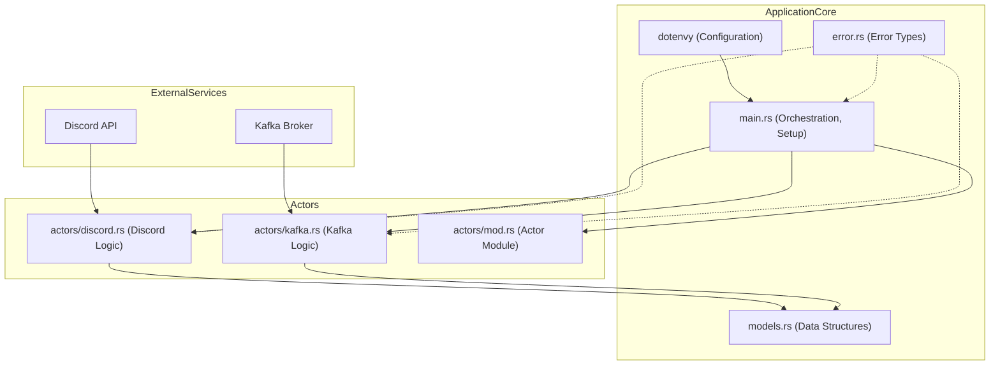

# Norppalive Discord Bot

A Discord bot designed to integrate with Norppalive services, involving real-time data streams via Kafka and interactions through the Discord API.

## Features

*   **Discord Integration**: Connects to Discord, listens to commands, and interacts with users/channels. (Powered by `poise` and `serenity`)
*   **Kafka Consumer**: Processes messages from Kafka topics. (Powered by `rdkafka`)
*   **Actor-based Concurrency**: Utilizes the Actix framework for managing concurrent tasks and state.
*   **Configuration Management**: Loads configuration from `.env` files. (Powered by `dotenvy`)
*   **Asynchronous Operations**: Built with `tokio` for efficient asynchronous I/O.
*   **Structured Logging**: Uses `tracing` for application logging.
*   **Error Handling**: Employs `thiserror` and `miette` for robust error management.

## Project Structure

The project is organized as follows:

*   `src/main.rs`: Main application entry point, initializes the bot, Kafka client, and actors.
*   `src/models.rs`: Defines data structures and models used throughout the application.
*   `src/error.rs`: Contains custom error types and error handling utilities.
*   `src/actors/`: Houses the Actix actors responsible for various parts of the business logic.
*   `Cargo.toml`: Rust package manifest, defines dependencies and project metadata.
*   `Dockerfile`: Defines the Docker image for building and running the application.

### Architecture Overview



## Getting Started

### Prerequisites

*   Rust (latest stable version recommended, see `rust-toolchain.toml` if present, or `Dockerfile` for version used in build)
*   Cargo (Rust's package manager)
*   Access to a Kafka instance (if running services that depend on it)
*   A Discord Bot Token

### Installation

1.  **Clone the repository (if you haven't already):**
    ```bash
    git clone https://github.com/dilaz/norppalive-discord
    cd norppalive-discord
    ```

2.  **Build the project:**
    ```bash
    cargo build --release
    ```
    The compiled binary will be located in `target/release/norppalive-discord`.

### Configuration

The application uses a `.env` file for configuration. Create a `.env` file in the root of the project with the necessary environment variables. Refer to the source code or required configurations for specific variables needed (e.g., `DISCORD_TOKEN`, `KAFKA_BROKERS`).

Example `.env` file:
```env
DISCORD_TOKEN="your_discord_bot_token"
KAFKA_BROKERS="localhost:9092"
# Add other necessary configuration variables
```

## Running the Application

Once built and configured, you can run the application using:

```bash
./target/release/norppalive-discord
```

Alternatively, if you have Docker, you can build and run the application using the provided `Dockerfile`:

1.  **Build the Docker image:**
    ```bash
    docker build -t norppalive-discord:latest .
    ```

2.  **Run the Docker container:**
    ```bash
    docker run -d --env-file .env --name norppalive-bot norppalive-discord
    ```
    (Ensure your `.env` file is correctly populated and accessible)

## License

MIT
